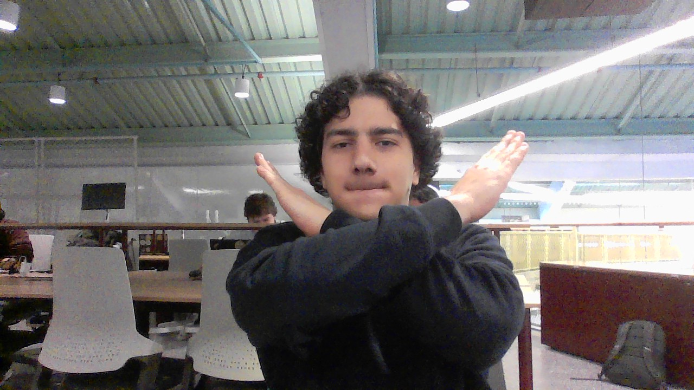

# Two Sum

&nbsp;&nbsp;&nbsp;&nbsp; O objetivo do problema Two Sum é encontrar os dois números em um array que somados deem o valor do target.

&nbsp;&nbsp;&nbsp;&nbsp; Para isso desenvolvi o seguinte código: 

```java
public int[] twoSum(int[] nums, int target) {
        //Itera sobre todos itens do array
        for(int i = 0; i < nums.length; i ++){
            //Itera sobre todos itens posteriores ao item i
            for (int j = i + 1; j < nums.length; j ++ ) {
                //Verifica se a soma de i + j é igual ao target
                if (nums[i] + nums[j] == target) {
                    //Caso seja igual ao target um array com o index de i e j é retornado
                    return new int[]{i, j};
                }
            }
        }

        //Caso nenhum resultado seja encontrado um aviso é emitido
        throw new IllegalArgumentException("No two sum solution");
    }
```

## Lógica do Algoritmo
- Iterar por todos os elementos do array nums com dois laços aninhados:
    - O primeiro laço percorre o array do início até o penúltimo elemento.
    - O segundo laço percorre os elementos à frente do elemento atual do primeiro laço.
- Para cada par (i, j):
    - Verificar se nums[i] + nums[j] == target.
    - Se verdadeiro, retornar imediatamente os índices {i, j}.
- Caso nenhum par de números satisfaça a condição, uma exceção é lançada indicando que não há solução válida.

## Complexidade
- Tempo: O algoritmo possui complexidade O(n²), onde n é o tamanho do array, devido aos dois laços aninhados.

- Espaço: O uso de espaço adicional é O(1), pois apenas algumas variáveis simples são utilizadas, além da resposta retornada.

<div style="display: flex; align-items: center; justify-content: center;">
    
    <div>
        <p>Meu nome é Leonardo Ogata e essa foi minha master class, muito obrigado a todos, vejo vocês amanhã!</p>
    </div>
</div>
