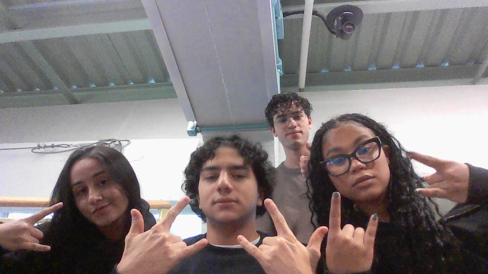

# Roman To Integer

&nbsp;&nbsp;&nbsp;&nbsp; O objetivo do problema Roman to Integer é converter o valor de algarismos romanos para número inteiros.

&nbsp;&nbsp;&nbsp;&nbsp; Para isso desenvolvi o seguinte código: 

```java
public int romanToInt(String s) {
        // Cria um hashmap correlacionando o valor de cada algarismo romano com um valor inteiro
        HashMap<Character, Integer> romanNumeral = new HashMap<>();
        romanNumeral.put('I', 1);
        romanNumeral.put('V', 5);
        romanNumeral.put('X', 10);
        romanNumeral.put('L', 50);
        romanNumeral.put('C', 100);
        romanNumeral.put('D', 500);
        romanNumeral.put('M', 1000);
        
        // Cria uma variável para armazenar o valor 
        int inteiro = 0;

        // Itera sobre a String 
        for (int i = 0; i < s.length(); i++) {
            // Verifica se o número é menor que o da frente
            if (i + 1 < s.length() && romanNumeral.get(s.charAt(i)) < romanNumeral.get(s.charAt(i + 1))) {
                // Subtrai o número pelo da frente
                inteiro += romanNumeral.get(s.charAt(i + 1)) - romanNumeral.get(s.charAt(i));

                // Pula para o próximo algarismo
                i++;

            }else{

                // Soma o algorismo ao número
                inteiro += romanNumeral.get(s.charAt(i));

            }
            
        }

        // Retorna o valor inteiro
        return inteiro;
    }
```

## Lógica do Algoritmo
- Iterar sobre a String `s`:
    - Caso o valor de i + 1 seja maior que i o número é subtraido
        - O número subtraído é adicionado o valor inteiro e 1 é adicionado a i para pularmos para o próximo algarismo
    - Caso o valor de i + 1 seja menor que i o número é adicionado ao valor inteiro
    - Ao fim do loop o valor inteiro é retornado


## Complexidade
- Tempo: O algoritmo possui complexidade O(${n}$), onde n é tamanho da string s.

- Espaço: O uso de espaço adicional é O(1), pois o algoritmo usa apenas variáveis auxiliares.

<div style="display: flex; align-items: center; justify-content: center;">
    
    <div>
        <p>Meu nome é Leonardo Ogata e essa foi minha master class, muito obrigado a todos, vejo vocês amanhã!</p>
    </div>
</div>
