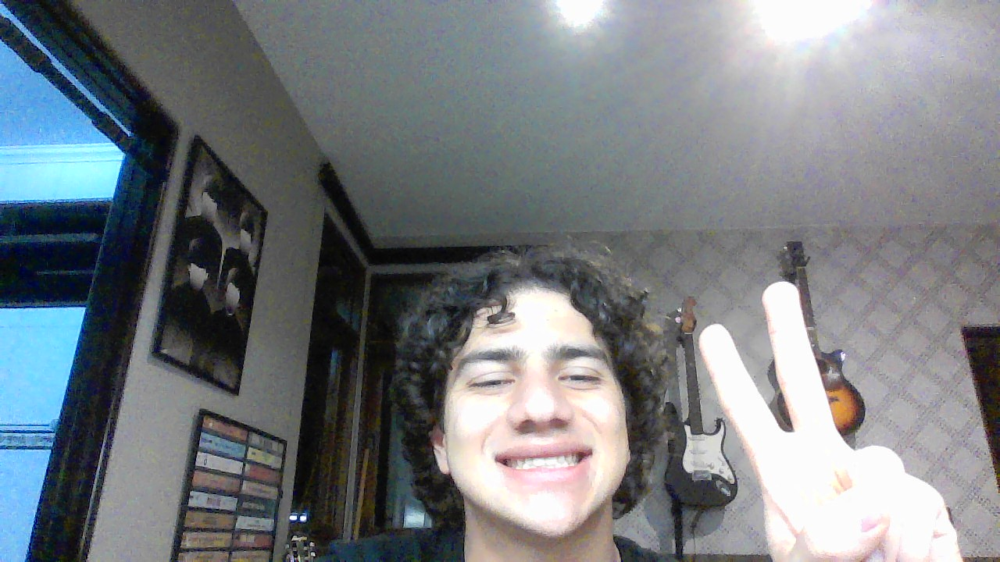

# Shuffle the Array

&nbsp;&nbsp;&nbsp;&nbsp; O objetivo do problema Shuffle the Array é retornar um array que embaralhado alternando entre os itens da primeira metade do array e da segunda


&nbsp;&nbsp;&nbsp;&nbsp; Para isso desenvolvi o seguinte código: 

```python
def shuffle(self, nums: List[int], n: int) -> List[int]:
        # Armazena itens da primeira metade do array
        aux1 = []
        # Armazena itens da segunda metade do array
        aux2 = []
        # Armazena array embaralhado
        ans = []

        # Itera sobre a primeira metade 
        for i in range(n):
            # Adiciona itens da primeira metade ao array 1
            aux1.append(nums[i])
        
        # Itera sobre a segunda metade 
        for i in range(n, len(nums)):
            # Adiciona itens da segunda metade ao array 2
            aux2.append(nums[i])

        # Itera sobre os arrays adicionanod um de cada
        for i in range(len(aux1)):
            ans.append(aux1[i])
            ans.append(aux2[i])
        
        # Retorna o array embaralhado
        return ans
```

## Complexidade
- Tempo: O algoritmo possui complexidade O(n), onde n é o tamanho do array nums.

- Espaço: O uso de espaço adicional é O(n).

<div style="display: flex; align-items: center; justify-content: center;">
    
    <div>
        <p>Meu nome é Leonardo Ogata e essa foi minha master class, muito obrigado a todos, vejo vocês amanhã!</p>
    </div>
</div>
