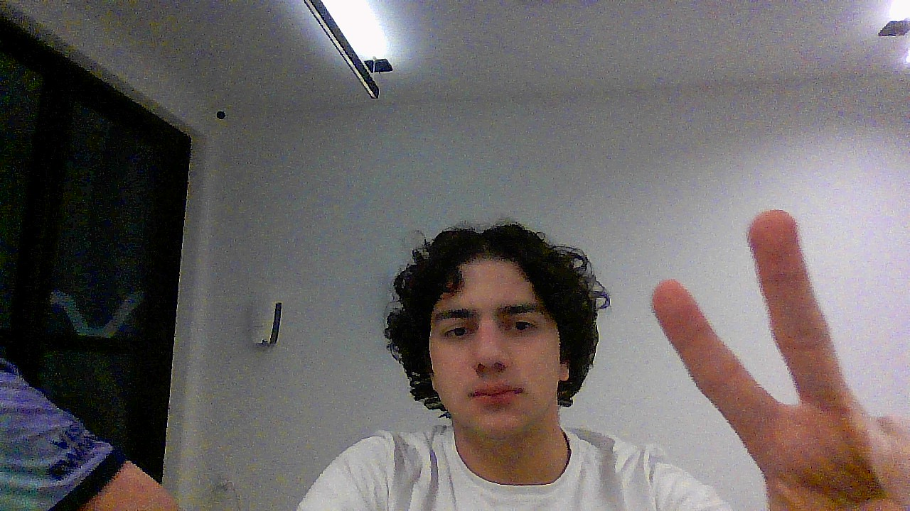

# Letter Combinations of a Phone Number

&nbsp;&nbsp;&nbsp;&nbsp; O objetivo do problema Letter Combinations of a Phone Number é retonar todas as combinações que um número pode ter de formas de digitação em um celular antigo. 

&nbsp;&nbsp;&nbsp;&nbsp; Para isso desenvolvi o seguinte código: 

```python
 def letterCombinations(self, digits):
        """
        :type digits: str
        :rtype: List[str]
        """
        # Cria array para armazenar os resultados
        result = []
        # Cria hash map com as letras de cada tecla
        phone_map = {
            "2": "abc",
            "3": "def",
            "4": "ghi",
            "5": "jkl",
            "6": "mno",
            "7": "pqrs",
            "8": "tuv",
            "9": "wxyz"
        }

        # Cria função de backtracking
        def backtracking(i, curStr):
            # Caso a string que está sendo montada tenha a mesma quantidade de digitos qeu digits a combinação é adicionada
            if len(curStr) == len(digits):
                result.append(curStr)
                return      
            
            # Faz as combinações possíveis recursivamente
            for char in phone_map[digits[i]]:
                backtracking(i + 1, curStr + char) 
        
        if digits:
            backtracking(0, "")

        return result
```

## Complexidade
- Tempo: O algoritmo possui complexidade de aproximadamente O($4^n$), onde n é a quantidade de digitos.
- Espaço: O uso de espaço adicional é O(${4^n}$), onde n é a quantidade de digitos.

<div style="display: flex; align-items: center; justify-content: center;">
    
    <div>
        <p>Meu nome é Leonardo Ogata e essa foi minha master class, muito obrigado a todos, vejo vocês amanhã!</p>
    </div>
</div>
