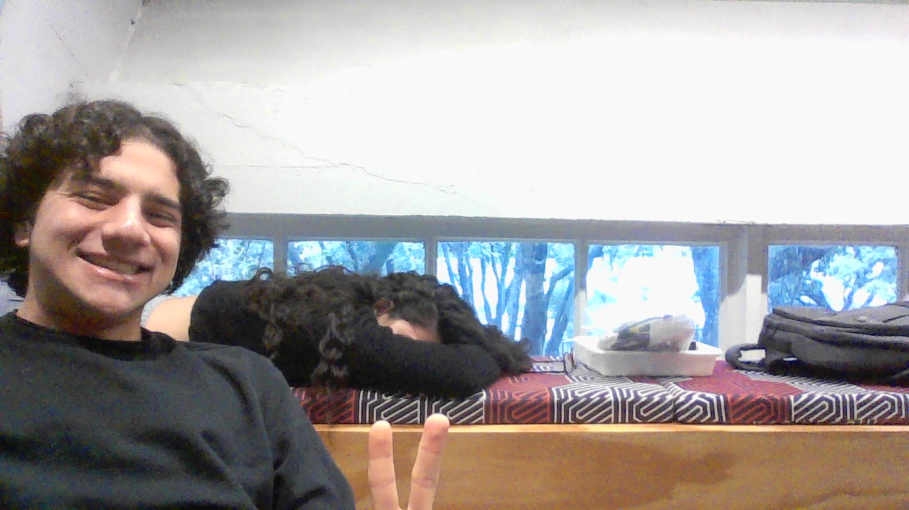

# Contains Duplicate II

&nbsp;&nbsp;&nbsp;&nbsp; O objetivo do problema Contains Duplicate II é identificar se existem números duplicados em um array e se a diferença absoluta entre os indices é menor que um valor k.

&nbsp;&nbsp;&nbsp;&nbsp; Para isso desenvolvi o seguinte código: 

```javascript
/**
 * @param {number[]} nums
 * @param {number} k
 * @return {boolean}
 */
var containsNearbyDuplicate = function(nums, k) {

    // Cria dicionário pra armazenar itens
    const dict = {};  

    // Itera sobre o array
    for (let i = 0; i < nums.length; i++) {
        // Verifica se um número já existe no dicionário
        if (nums[i] in dict) {
            // Caso sim verifica se a diferença é menor que k
            if (Math.abs(i - dict[nums[i]]) <= k) {
                return true;  
            }
        }
        // Adiciona item novo no sistema
        dict[nums[i]] = i;  
    }

    return false;  
};
```

## Complexidade
- Tempo: O algoritmo possui complexidade O(n), onde n é o tamanho do array.

- Espaço: O uso de espaço adicional é O(n), onde n é o tamanho do array.

<div style="display: flex; align-items: center; justify-content: center;">
    
    <div>
        <p>Meu nome é Leonardo Ogata e essa foi minha master class, muito obrigado a todos, vejo vocês amanhã!</p>
    </div>
</div>
