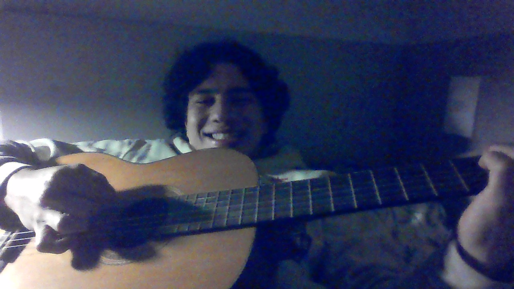

# emove Duplicates from Sorted Array

&nbsp;&nbsp;&nbsp;&nbsp; O objetivo do problema Remove Duplicates from Sorted Array é remover os número duplicados de um array ordenado 

&nbsp;&nbsp;&nbsp;&nbsp; Para isso desenvolvi o primeiramente o seguinte código: 

```java
public int removeDuplicates(int[] nums) {
        // Cria um array dinâmico para guardar números não repetidos
        ArrayList<Integer> correct = new ArrayList<>();

        // Cria variável auxiliar para marcar o número atual do loop
        int atual = 0;

        // Itera sobre o array nums
        for (int i = 0; i < nums.length; i++){
            // Define o primeirmo número como número atual e o adiciona no array dinâmico
            if (i == 0) {
                atual = nums[i];
                correct.add(nums[i]);
            }

            // Caso o número seja diferente do atual ele é adicionado ao array dinâmico e se torna o novo atual
            if (nums[i] != atual) {
                atual = nums[i];
                correct.add(nums[i]);
            }
        }


        // Cola os itens do array dinâmico por cima dos itens do array original
        for (int i = 0; i < correct.size(); i ++) {
            nums[i] = correct.get(i);
        }
        
        // Retorna o tamanho do array dinâmico que equivale a a quantidade de números não repetidos
        return correct.size();
    }

```

## Lógica do Algoritmo
- Após a criação das variáveis auxiliares o código itera sobre o array nums
    - No primeiro ciclo o número atual é definido como o primeiro número do array e é adicionado ao array dinamico
    - Nos ciclos seguintes caso o número seja diferente do número atual ele é adicionado ao array dinâmico e se torna o novo atual
- Ao fim do loop os itens do array dinâmico são colados em ordem por cima dos itens do array original assim ordenando ele 
> Deixando claro que o problema deixa explicito que os itens após os números ordenados não são levados em consideração, por isso o array fica "bagunçado" no final
- É retornado o tamanho do array dinâmico que representa a quantidade de números não repetidos

## Complexidade
- Tempo: O algoritmo possui complexidade O(${n}$), onde n é o tamanho do array.
- Espaço: O uso de espaço adicional é O(${n}$), onde n é o tamanho do array.

<div style="display: flex; align-items: center; justify-content: center;">
    
    <div>
        <p>Meu nome é Leonardo Ogata e essa foi minha master class, muito obrigado a todos, vejo vocês amanhã!</p>
    </div>
</div>
