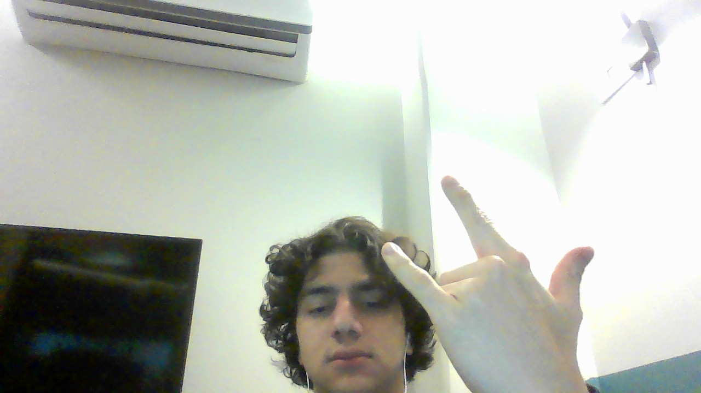

# Ugly Number

&nbsp;&nbsp;&nbsp;&nbsp; O objetivo do problema Ugly Number é retornar se um número é feio ou não. Um número pode ser considerado feio quando ele é divisível por outros números primos que não 2, 3 e 5.

&nbsp;&nbsp;&nbsp;&nbsp; Para isso desenvolvi o seguinte código: 

```javascript
var isUgly = function(n) {
    // Verifica se o número é maior que 1
    if (n < 1){
        return false
    }

    // Cria array com possíveis divisões
    let arr = [2, 3, 5]

    // Itera sobre os itens do array
    for(let i = 0; i < arr.length; i++){
        // Loop que divide o número pelo item do array até não dar mais
        while(n % arr[i] == 0){
            n = n / arr[i]
        }
    }

    // Caso n seja 1 é um número feio caso o contrário não
    return n == 1
};
```

## Complexidade
- Tempo: O algoritmo possui complexidade O($\log{n}$), onde n é o valor do número.

- Espaço: O uso de espaço adicional é O(1).

<div style="display: flex; align-items: center; justify-content: center;">
    
    <div>
        <p>Meu nome é Leonardo Ogata e essa foi minha master class, muito obrigado a todos, vejo vocês amanhã!</p>
    </div>
</div>
