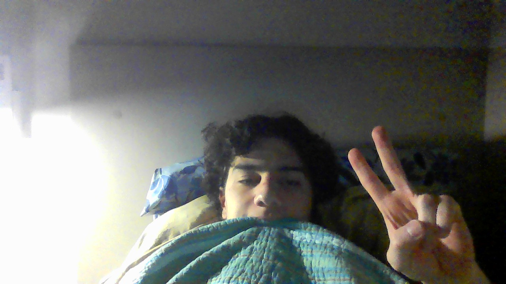

# First Bad Version

&nbsp;&nbsp;&nbsp;&nbsp; O objetivo do problema First Bad Version é identificar a primeira versão ruim de um produto considerando que após a primeira ruim todas as outras também serão ruins

&nbsp;&nbsp;&nbsp;&nbsp; Para isso desenvolvi o seguinte código: 

```python
def firstBadVersion(self, n: int) -> int:
        # Define o valor minimo
        low = 0 
        # Define o valor máximo
        high = n

        # Itera enquanto o valor minimo for menor ou igual ao máximo
        while low <= high:
            # Define o valor do meio arredondando para baixo
            mid = (low + high)//2

            # Caso o valor do meio seja verdadeiro e o anteriro seja falso o valor do meio é a primeira versão ruim
            if isBadVersion(mid) and not isBadVersion(mid-1):
                return mid    

            # Caso o valor do meio seja verdadeiro e o anteriro também o valor do meio está a frente da primeira versão ruim
            elif isBadVersion(mid) and isBadVersion(mid-1):
                # Transforma o limite máximo no meio 
                high = mid - 1

            # Caso o valor do meio seja falso ainda não chegamos nas versões ruins
            elif not isBadVersion(mid):
                # Transforma o limite mínimo no meio
                low = mid + 1
```

## Complexidade
- Tempo: O algoritmo possui complexidade O($\log{n}$), onde n é o número.

- Espaço: O uso de espaço adicional é O(1).

<div style="display: flex; align-items: center; justify-content: center;">
    
    <div>
        <p>Meu nome é Leonardo Ogata e essa foi minha master class, muito obrigado a todos, vejo vocês amanhã!</p>
    </div>
</div>
