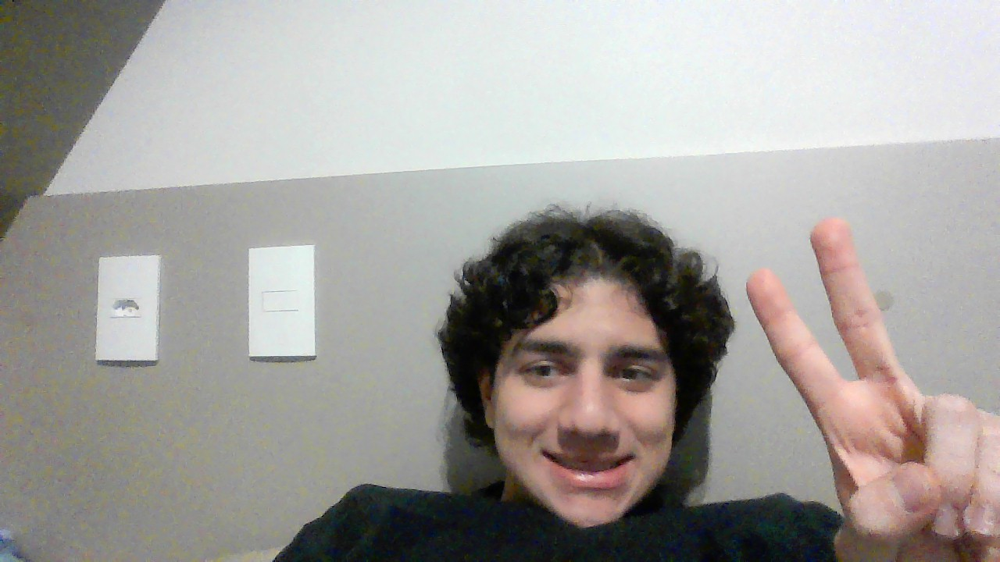

# Intersection of Two Arrays

&nbsp;&nbsp;&nbsp;&nbsp; O objetivo do problema Intersection of Two Arrays é identificar os número que estão presentes em ambos arrays

&nbsp;&nbsp;&nbsp;&nbsp; Para isso desenvolvi o seguinte código: 

```python
    def arrangeCoins(self, n):
    """
    :type n: int
    :rtype: int
    """
    # Variável de conta
    i = 0
    # Itera enquanto n for maior que 0
    while n > 0:
        # Subtrai o valor do degrau de n
        n -= i
        # Atualiza o valor do próximo degrau
        i +=1

    # Caso n seja menor que 0 o valor de i deve ser subtráido 2 para descontar uma iteração extra e a linha incompleta
    # Caso n seja igual a 0 o valor de i deve ser subtráido 1 a linha incompleta
    return i - 2 if n < 0 else i - 1
```

## Complexidade
- Tempo: O algoritmo possui complexidade O(n), onde n é o valor n.

- Espaço: O uso de espaço adicional é O(1).

<div style="display: flex; align-items: center; justify-content: center;">
    
    <div>
        <p>Meu nome é Leonardo Ogata e essa foi minha master class, muito obrigado a todos, vejo vocês amanhã!</p>
    </div>
</div>
