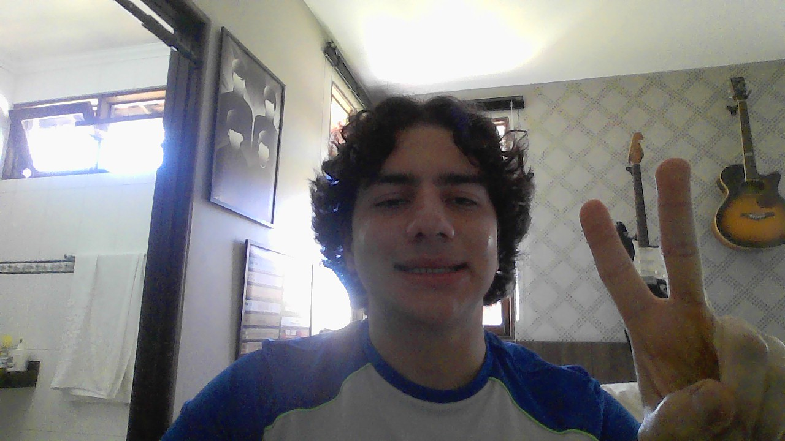

# License Key Formatting

&nbsp;&nbsp;&nbsp;&nbsp; O objetivo do problema License Key Formatting é formatar uma chave separando entre "-" a cada k digitos e os número que sobrarem devem ser colocados na frente

&nbsp;&nbsp;&nbsp;&nbsp; Para isso desenvolvi o seguinte código: 

```python
def licenseKeyFormatting(self, s: str, k: int) -> str:
        # Casos base
        if s == "-":
            return ""
        elif len(s) == 1:
            return s.upper()

        # Variável que armazena resposta
        ans = ""
        # Variável que armazena quantos traços tem a chave
        dashes = 0
        # Conta quantidade de traços
        for i in s:
            if i == "-":
                dashes += 1 

        # Cálcula quantos digitos de resto serão colocados na frente 
        rest = (len(s) - dashes) % k

        # Remove todos os traços da chave
        s = s.replace("-", "")

        # Contador da posição do caractere
        counter = 0

        # Caso tenha resto
        if rest != 0:
            # Adiciona os restos no primeiro bloco e adiciona o - de divisão
            for i in range(rest):
                ans += s[counter]
                counter += 1
            ans += "-"

        # Contador de divisão
        i = 1
        # Itera pelo resto da palavra
        while counter < len(s):
            # Caso o resto da divisão por k seja 0, não seja o primeiro caractere e nem o último adiciona o - de divisão
            if i % k == 0 and i != 0 and counter != len(s) -1:
                ans += s[counter]
                ans += "-"
            # Caso o contrário só adiciona o caracter
            else: 
                ans += s[counter]
            # Atualiza posição do contador
            counter += 1
            # Atualiza contador de divisão
            i += 1

        # Retorna a resposta em letra maiúsculas
        return ans.upper()
```

## Complexidade
- Tempo: O algoritmo possui complexidade O(n), onde n é o tamanho de s.

- Espaço: O uso de espaço adicional é O(n), onde n é o tamanho de s.

<div style="display: flex; align-items: center; justify-content: center;">
    
    <div>
        <p>Meu nome é Leonardo Ogata e essa foi minha master class, muito obrigado a todos, vejo vocês amanhã!</p>
    </div>
</div>
