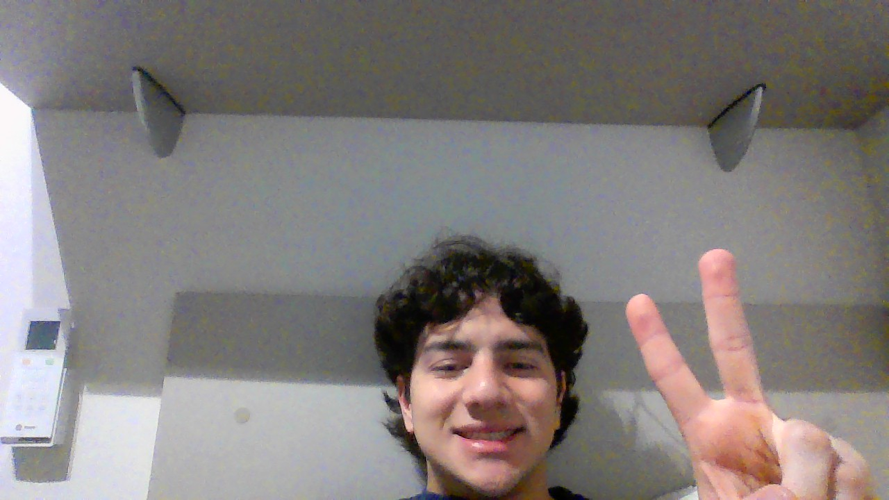

# Keyboard Row

&nbsp;&nbsp;&nbsp;&nbsp; O objetivo do problema Keyboard Row é identificar as palavras que podem ser escritas utilizando apenas uma das três do teclado

&nbsp;&nbsp;&nbsp;&nbsp; Para isso desenvolvi o seguinte código: 

```python
    def findWords(self, words: List[str]) -> List[str]:
        # Fução verifica se a palavra pode ser escrita apenas com a primeira linha
        def firstRow(s: string) -> bool:
            s = s.lower()
            row1 = {'q', 'w', 'e', 'r', 't', 'y', 'u', 'i', 'o', 'p'}

            for i in s:
                if i not in row1: 
                    return False
            
            return True

        # Fução verifica se a palavra pode ser escrita apenas com a segunda linha
        def secondRow(s: string) -> bool:
            s = s.lower()
            row2 = {'a', 's', 'd', 'f', 'g', 'h', 'j', 'k', 'l'}
            for i in s:
                if i not in row2:
                    return False
            
            return True

        # Fução verifica se a palavra pode ser escrita apenas com a terceira linha
        def thirdRow(s: string) -> bool:
            s = s.lower()
            row3 = {'z', 'x', 'c', 'v', 'b', 'n', 'm'}
            for i in s:
                if i not in row3:
                    return False
            
            return True

        # Array para armazenar resposta
        arr = []

        # Itera sobre o array de palavras
        for i in words:
            # Caso a palavra possa ser escrita com a primeira linha adiciona a palavra ao array de resposta
            if firstRow(i):
                arr.append(i)
            # Caso a palavra possa ser escrita com a segunda linha adiciona a palavra ao array de resposta
            elif secondRow(i):
                arr.append(i)
            # Caso a palavra possa ser escrita com a terceira linha adiciona a palavra ao array de resposta
            elif thirdRow(i):
                arr.append(i)

        # Retorna o array de resposta
        return arr
```

## Complexidade
- Tempo: O algoritmo possui complexidade O(n), onde n é o tamanho do array words.

- Espaço: O uso de espaço adicional é O(1).

<div style="display: flex; align-items: center; justify-content: center;">
    
    <div>
        <p>Meu nome é Leonardo Ogata e essa foi minha master class, muito obrigado a todos, vejo vocês amanhã!</p>
    </div>
</div>
