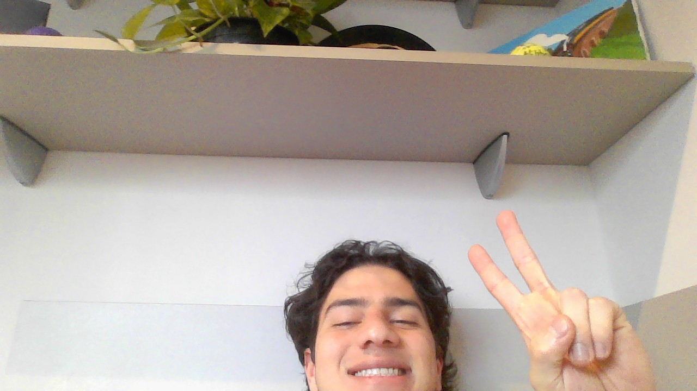

# Base 7

&nbsp;&nbsp;&nbsp;&nbsp; O objetivo do problema Base 7 é converter um número para seu formato em base heptagonal

&nbsp;&nbsp;&nbsp;&nbsp; Para isso desenvolvi o seguinte código: 

```python
    def convertToBase7(self, num: int) -> str:
        # Caso base
        if num == 0:
            return "0"

        # Marcador de número negativo
        neg = False

        # Caso o número seja negativo ativa o marcador e converte ele para positivo
        if num < 0:
            neg = True
            num *= -1
        
        # String que receberá a resposta
        string = ""

        # loop enquanto o número for maior que 0
        while num > 0:
            # Adiciona na string o resto de número divido por 7
            string += str(num % 7)
            # Atualiza o valor do número
            num = num // 7

        # Inverte a string para obter o formato correto da base 7
        reverse = string[::-1]
        
        # Caso o número seja positivo é retornado a string invertida, caso ele seja negativo é retornado a string invertidas vezes -1
        return reverse if neg == False else (str(int(reverse) * -1))
```

## Complexidade
- Tempo: O algoritmo possui complexidade O($\log_7{n}$), onde n é a quantidade de digitos do número.

- Espaço: O uso de espaço adicional é O(n).

<div style="display: flex; align-items: center; justify-content: center;">
    
    <div>
        <p>Meu nome é Leonardo Ogata e essa foi minha master class, muito obrigado a todos, vejo vocês amanhã!</p>
    </div>
</div>
