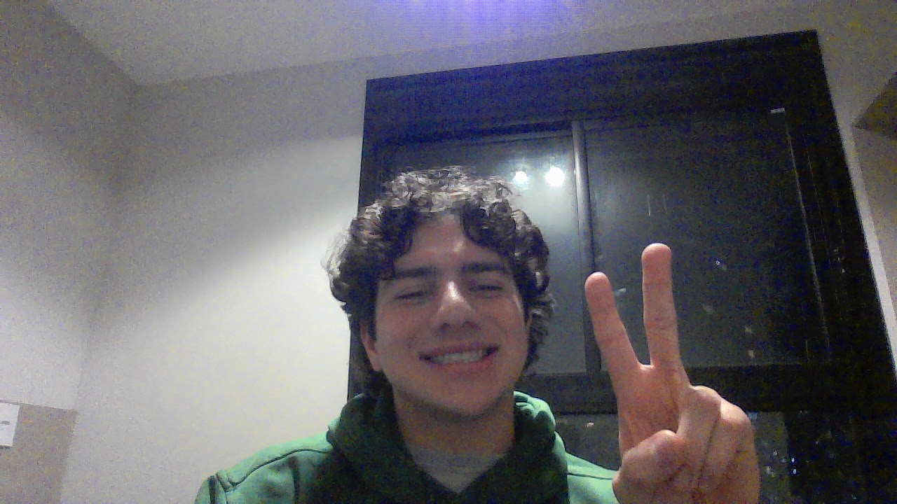

# Relative Ranks

&nbsp;&nbsp;&nbsp;&nbsp; O objetivo do problema Relative Ranks é identificar a colocação dos participantes de acordo com sua pontuação e retornar um array com as coloções mantendo a ordem dos participantes

&nbsp;&nbsp;&nbsp;&nbsp; Para isso desenvolvi o seguinte código: 

```go
    func findRelativeRanks(score []int) []string {

        // Cria dicionário para receber valores das pontuações
        dic := make(map[int]string) 

        // Itera pelo dicionário adicionando as pontuações relacionadas a valores vazios
        for _, v := range score{
            dic[v] = ""
        }

        // Cria array para aramazenar as pontuações
        keys := make([]int, 0, len(dic))
        // Adiciona pontuações ao array
        for k := range dic {
            keys = append(keys, k)
        }
        
        // Ordena a pontuação de maneira decrescente
        sort.Sort(sort.Reverse(sort.IntSlice(keys)))

        // Adicina no dicionário a colocação de cada um 
        for i, key := range keys{
            // Medalha de ouro para o primeiro
            if i == 0 {
                dic[key] = "Gold Medal"
            // Medalha de prata para o segundo
            } else if i == 1{
                dic[key] = "Silver Medal"
            // Medalha de bronze para o terceiro
            } else if i == 2 {
                dic[key] = "Bronze Medal"
            // E para o resto a sua devida colocação em forma numérica
            } else {
                dic[key] = strconv.Itoa(i + 1)
            }
        }

        // Cria array para armazenar resposta
        ans := make([]string, len(score))

        // Adiciona ao array a coloção de cada valor na ordem original
        for i, value := range score {
            ans[i] = dic[value]
        }

        // Retorna o array de resposta
        return ans
}
```

## Complexidade
- Tempo: O algoritmo possui complexidade O($n\log{n}$), onde n é a quantidade de digitos do número.

- Espaço: O uso de espaço adicional é O(n).

<div style="display: flex; align-items: center; justify-content: center;">
    
    <div>
        <p>Meu nome é Leonardo Ogata e essa foi minha master class, muito obrigado a todos, vejo vocês amanhã!</p>
    </div>
</div>
