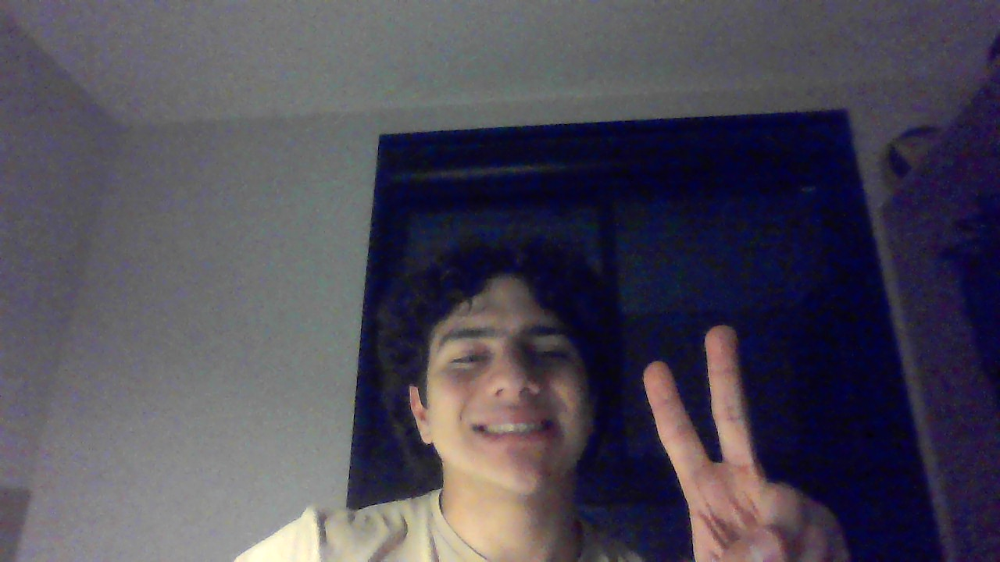

# Detect Capital

&nbsp;&nbsp;&nbsp;&nbsp; O objetivo do problema Detect Capital é retornar verdadeiro caso uma string atenda alguma das seguintes:
- Todos os caracteres são maiúsculos
- Apenas o primeiro caractere é maiúsculo
- Todos os caracteres são minúsculos 

&nbsp;&nbsp;&nbsp;&nbsp; Para isso desenvolvi o seguinte código: 

```go
func detectCapitalUse(word string) bool {
    // Caso base, pois qualquer caractere unico se adequa as regras
    if len(word) == 1 {
        return true
    }

    // Armazena a primeira letra
    firstLetter := []rune(word)[0]
    // Armazena a segunda letra letra
    secondLetter := []rune(word)[1]

    // Verifica se a primeira letra é maiúscula
    if unicode.IsUpper(firstLetter){
        // Verifica se a segunda letra é maiúscula
        if unicode.IsUpper(secondLetter){
            // Itera sobre a palavra
            for _, r := range word {
                // Caso algum caractere seja minúsculo a palavra não se adequa a regra
                if !unicode.IsUpper(r) {
                    return false
                }
            } 
        } else {
            // Variável contadora
            i := 0
            // Itera sobre a palavra
            for _, r := range word {
                // Verifica se há alguma letra que não seja a primeira que é seja maiúscula 
                if unicode.IsUpper(r) && i > 0 {
                    return false
                }
                // Atualiza contador 
                i++
            } 
        }
    } else {
        // Itera sobre a palavra
        for _, r := range word {
            // Caso alguma letra seja maiuscula retorna falso
            if unicode.IsUpper(r) {
                    return false
                }
        }
    }

    // Caso a palavra passe por todas as verificações ela se enquadra na regra 
    return true
    
}
```

## Complexidade
- Tempo: O algoritmo possui complexidade O($n$), onde n é o tamanho da string word.

- Espaço: O uso de espaço adicional é O(1).

<div style="display: flex; align-items: center; justify-content: center;">
    
    <div>
        <p>Meu nome é Leonardo Ogata e essa foi minha master class, muito obrigado a todos, vejo vocês amanhã!</p>
    </div>
</div>
