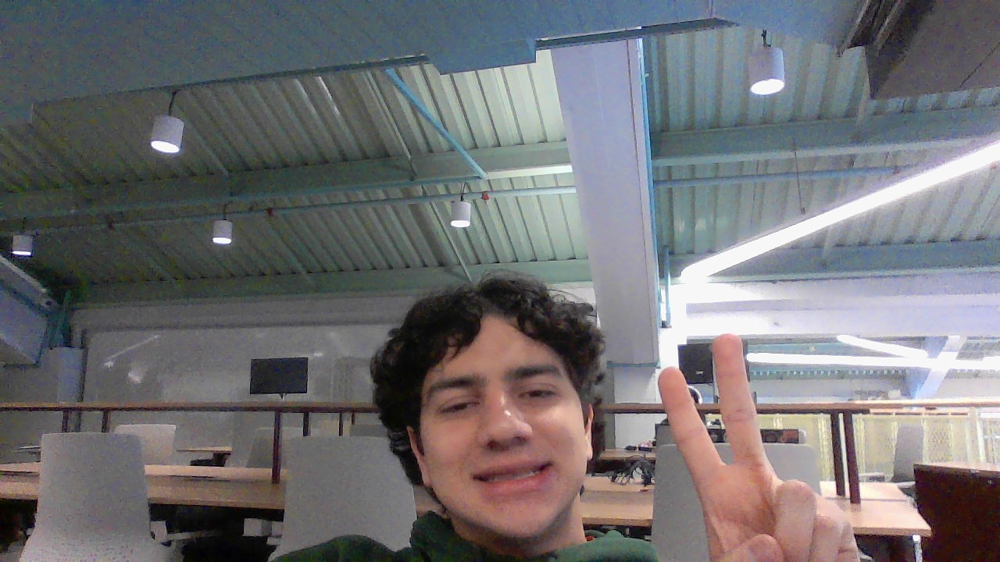

# Reverse Words in a String III

&nbsp;&nbsp;&nbsp;&nbsp; O objetivo do problema Reverse Words in a String III é retornas as palavras da string s invertidas individualmente mantendo seus espaços

&nbsp;&nbsp;&nbsp;&nbsp; Para isso desenvolvi o seguinte código: 

```python
    def reverseWords(self, s: str) -> str:
        # Ponteiro que marca fim da palavra
        right = 0
        # Resposta final
        ans = ""
        # Armazena palavras da string
        temp = ""

        # Itera sobre a string
        while right < len(s):
            # Caso o caractere seja um espaço
            if s[right] == " ":
                # Inverte a palavra até o momento
                temp = temp[::-1]
                # Adiciona o espaço
                temp += s[right]
                # Adiciona a palavra invertida e seu espaço à resposta 
                ans += temp
                # Zera a palavra atual
                temp = ""
            # Caso o caractere não seja um espaço
            else:
                # Adiciona o caractere na palavra atual
                temp += s[right]

            # Avança o ponteiro para o próximo caractere
            right += 1

        # Caso ainda tenha alguma palavra em temp ela é adicionada invertida na respota final
        if temp:
            ans += temp[::-1]

        # Retorna as palavras invertidas
        return ans
```

## Complexidade
- Tempo: O algoritmo possui complexidade O(n), onde n é o tamanho da string s.

- Espaço: O uso de espaço adicional é O(1).

<div style="display: flex; align-items: center; justify-content: center;">
    
    <div>
        <p>Meu nome é Leonardo Ogata e essa foi minha master class, muito obrigado a todos, vejo vocês amanhã!</p>
    </div>
</div>
