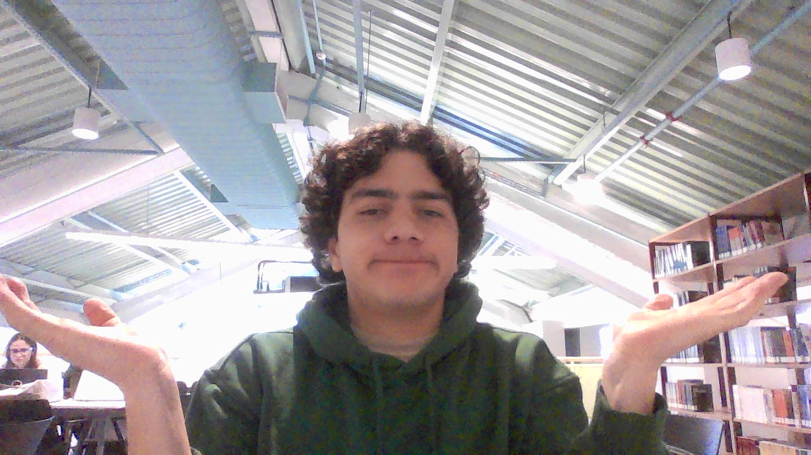

# Palindrome Number

&nbsp;&nbsp;&nbsp;&nbsp; O objetivo do problema Palindrome Number é verificar se um número é um palindromo, ou seja, validar se um número espelhado é igual ao número originial.

&nbsp;&nbsp;&nbsp;&nbsp; Para isso desenvolvi o seguinte código: 

```java
public boolean isPalindrome(int x) {
        // salva o número original para comparação futura
        int origin = x;
        // Inicia a variável que receberá o número invertido
        int resverse = 0;
        
        // Loop de inversão do número
        while (x > 0) {
            // Pega o último digito do número
            int rest = x % 10;
            // Adiciona último digito ao número invertido
            resverse = resverse * 10 + rest;
            // Atualiza o número removendo o último digito
            x = x / 10;
        }

        // Retorna se o número é igual ao invertido ou não
        if (origin == resverse) {
            System.out.println("Palindromo");
            return true;
        }else{
            System.out.println("Nem é");
            return false;
        }
    }
```

## Lógica do Algoritmo
- Iterar sobre a variável `x` até que ela seja menor que 0:
    - A cada iteração o valor do último digito é salvo e adicionado ao número invertido.
    - A cada iteração o valor de `x` atualizado removendo o último digito do número.
    - O loop é interrompido quando `x` for menor que 0 indicando que o último digito do número foi adicionado ao array invertido.
- O número original é comparado com o número invertido retorando `true` caso os números sejam iguais e `false` caso o contrário. 

## Complexidade
- Tempo: O algoritmo possui complexidade O($\log{n}$), onde n é o valor da entrada x.

- Espaço: O uso de espaço adicional é O(1), pois o algoritmo usa apenas variáveis auxiliares.

<div style="display: flex; align-items: center; justify-content: center;">
    
    <div>
        <p>Meu nome é Leonardo Ogata e essa foi minha master class, muito obrigado a todos, vejo vocês amanhã!</p>
    </div>
</div>
