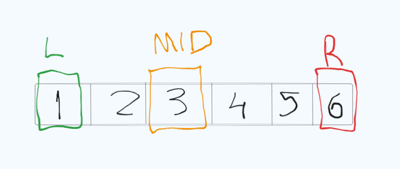
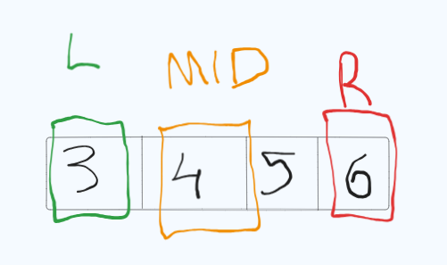

# Hoje eu dormi mais que o normal, então tô relaxado e com preguiça
## Desafio dia 03/200

Eu tava procurando algum exercício no leetcode de algo que eu já tinha estudado, e me deparo com um só de escrever o binary search e pensei "Por que não?". Então só pra brincar, decidi fazer até mesmo pra lembrar como faz, se não ia ficar enferrujado.

Mas enfim, binary search basicamente é um algoritmo de procura binária(gostaram da piada?)

1. Começamos com dois ponteiros: um no início do array e outro no final.
2. Calculamos o índice do meio entre esses dois ponteiros.
3. Verificamos o valor no meio:
   - Se for igual ao alvo, retornamos o índice do meio.
   - Se for menor que o alvo, ajustamos o ponteiro do início para o meio + 1 (ignorando a parte esquerda do array).
   - Se for maior que o alvo, ajustamos o ponteiro do fim para o meio - 1 (ignorando a parte direita do array).
4. Repetimos o processo até encontrar o valor ou até que os ponteiros se cruzem (o que significa que o valor não está no array).

Exemplo em Imagem:

