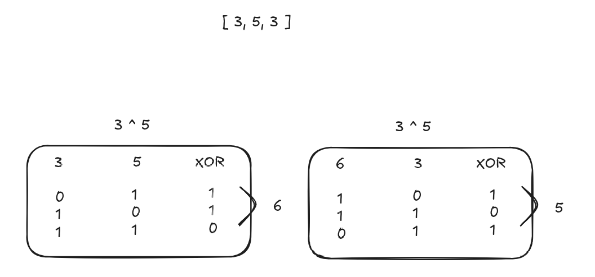

Esse exercício é bem simples de ser resolvido. Você pode ordenar o array e ir comparando seus valores ou simplesmente salvar em um hash os valores que não se repetem e depois verificar no resto do array se ele reaparece, porém, tem uma forma mais simples que foi como resolvi.
Básicamente nós usamos manipulação de binários. O Goya ensinou isso em aula. Quando usamos a porta lógica XOR a gente realiza as comparações bit a bit e no final as comparações resultam no número sem par.

Um exemplo bem simples seria o seguinte:

Pela imagem conseguimos ver que o resultado XOR de (3 ^ 5) ^ 3 será apenas 5.

Essa foi bem trivial 

Assinado
por: [Vinicius Testa Passos](https://www.linkedin.com/in/vinicius-testa-passos/)