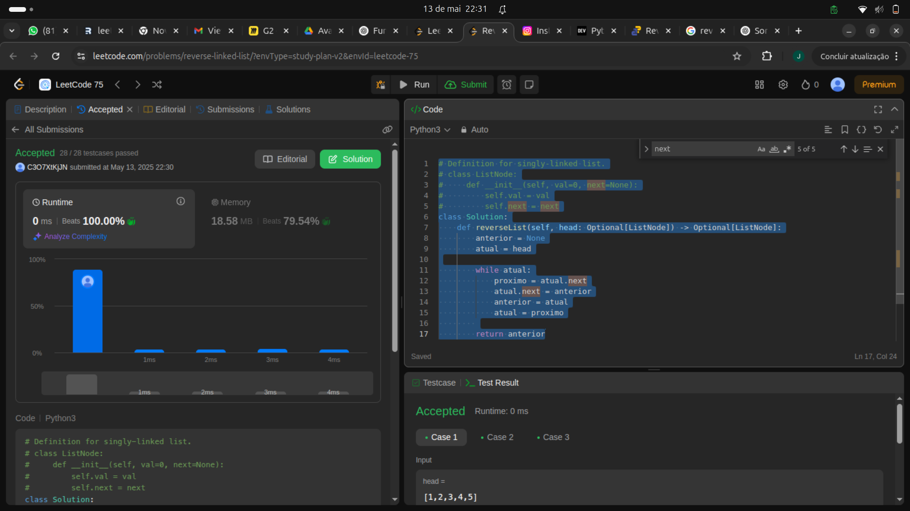

# Definition for singly-linked list.
# class ListNode:
#     def __init__(self, val=0, next=None):
#         self.val = val
#         self.next = next
class Solution:
    def reverseList(self, head: Optional[ListNode]) -> Optional[ListNode]:
        anterior = None
        atual = head

        while atual:
            proximo = atual.next
            atual.next = anterior
            anterior = atual
            atual = proximo
        
        return anterior

tava precisando de relembrar linked list, entao fui no classico: Reverter uma linked list!!!! 
Bem simples defino um ponto anterior que é null e o atual que é o head passado. Enquanto o atual nao for null, percorro a liked list invertendo tudo. Vou poupar a explicação dos swaps pq todo mundo aqui sabe ler. É isso é tois

