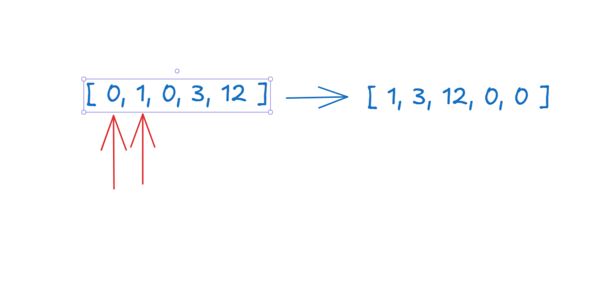

``` python 
class Solution:
    def moveZeroes(self, nums: List[int]) -> None:
        """
        Do not return anything, modify nums in-place instead.
        """
        if len(nums) == 1:
            return nums
        
        l = 0
        r = l+1

        while r <= len(nums)-1:
            if nums[l] == 0 and nums[r]==0:
                r+=1
            elif nums[l] == 0 and nums[r] != 0:
                nums[l], nums[r] = nums[r], nums[l]
                l+= 1
                r += 1
            else:
                l+=1
                r+=1
        
        print(nums)
```

Exercicio feito em parceria com a senhorita minha mulher.



Quebramos a cabeca juntos no Excalidraw sobre como resolver esse exercício. No final deu bom!! Ela não acreditou que conseguiria tirar a logica do excalidraw e passar pra codigo, mas o pai marola dmsssss. 
Vamo-lá! Primeira coisa, se tiver so um item eu retorno a lista como ela esta. Se nao, eu checo usando two pointers. Como faco isso, tenho dois ponteiros, um apontnaod pro primeiro e um pro segundo. Ai eu vou comparando, se o da esquerda for 0 e outro nao, eu troco. Se os dois forem 0 eu ando o da direita. Se nenhum for eu continuo andando.
MAROLAMOS.


