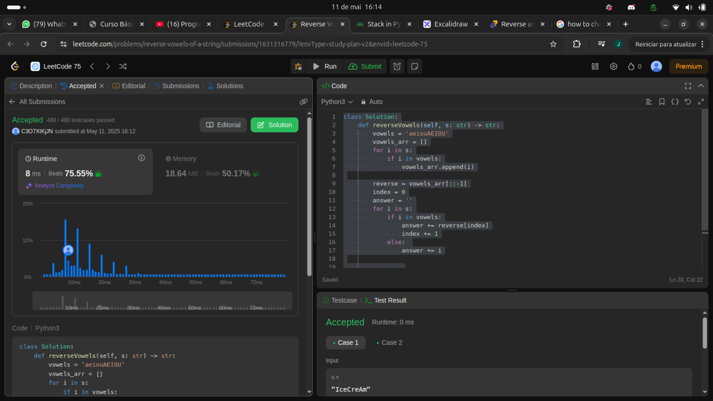

class Solution:
    def reverseVowels(self, s: str) -> str:
        vowels = 'aeiouAEIOU'
        vowels_arr = []
        for i in s:
            if i in vowels:
                vowels_arr.append(i)

        reverse = vowels_arr[::-1]
        index = 0
        answer = ''
        for i in s:
            if i in vowels:
                answer += reverse[index]
                index += 1
            else: 
                answer += i

                
        return answer

Exercício chatinho, com muito uso de memória.
primeiramente defino uma string com todas as vogais possiveis em maiusculo e minusculo.
em sequencia gero um array vazio que vai guardar as vogais que estao na string do input. Rodo um for para adicionar essas vogais nesse array. Em sequencia, gero uma copia do array em formato reverso. Usando um slice de array que eu nao conhecia (GUARDEM MTO UTIL). Em ssequncia, opto por percorrer a string denovo, vendo se é vogal ou nao, se nao eu substituo pelo respectivo no array invertido, para isso uso uma variavel "index".