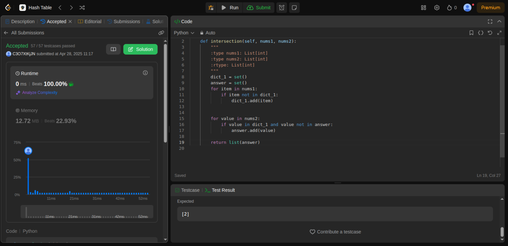

### Começar com Two Sum????? To fora! 

Desafiozinho de HashSet para começar! E sabe o melhor? Batendo 100% dos competidores, com a melhor solução possível!

Nesse desafio recebemos dois arrays e devemos encontrar os numeros que estao em ambos os arrays. Fácil né?

Para solucionar, pego o primeiro array e percorro ele, adicionando todos os valores em um set (note que aqui adicionamos eles apenas uma vez)

Feito isso, percorremos o outro array, checando se o valor está no set gerado pelo primeiro array. Se sim, checamos se ele ja foi inserido na resposta, caso não tenha sido, ele é adicionado no set de respostas (note que utilizei um set em detrimento de um array para que a busca fosse O(1)). Ao final esse set é convertido em lista no return.

Esse é só o começo, não se assustem!!!!!!!