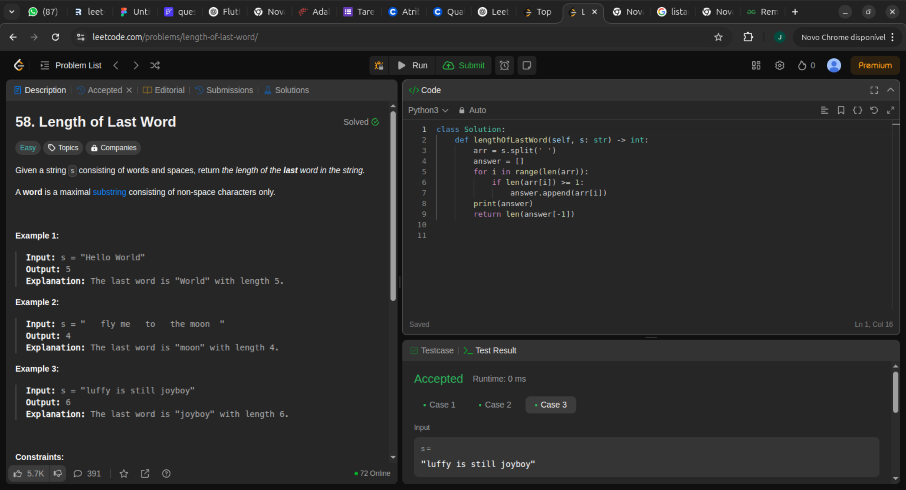

class Solution:
    def lengthOfLastWord(self, s: str) -> int:
        arr = s.split(' ')
        answer = []
        for i in range(len(arr)):
            if len(arr[i]) >= 1:
                answer.append(arr[i])
        print(answer)
        return len(answer[-1])

batendo impressionantes 100% em tempo e 98% em memoria, o foda chegou pras picas!

aqui eu faço um split na string por espaco, depois rodo um for para ver se o len de cada elemento do array é maior que 1 se for eu adiciono em novo array chamado answer, em sequencia, retorno o length do ultimo da lsita answer!!
Trivial!

## Complexidade
- Tempo: O(n), onde n é o tamanho da string de entrada.  
- Espaço: O(n), para armazenar a lista de palavras filtradas.