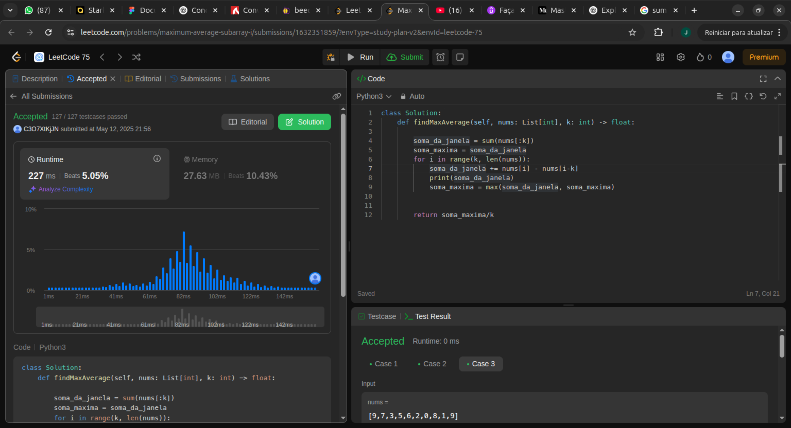

class Solution:
    def findMaxAverage(self, nums: List[int], k: int) -> float:
        
        soma_da_janela = sum(nums[:k])
        soma_maxima = soma_da_janela
        for i in range(k, len(nums)):
            soma_da_janela += nums[i] - nums[i-k]
            print(soma_da_janela)
            soma_maxima = 
        
        
        return soma_maxima/kmax(soma_da_janela, soma_maxima)

Rapaziadinha!!! Aprendi uma tecnica nova muito maneira! Não sabia sliding window e essa foi a hora de aprender.
Essa minha aplicacao é a exata aplicacao de sliding window.
Vou acompanhando uma janela, e a cada iteracao adiciono um e removo o primeiro. Ai eu comparo com o maior ate o momento. Se for maior eu substituo, se nao eu mantenho!